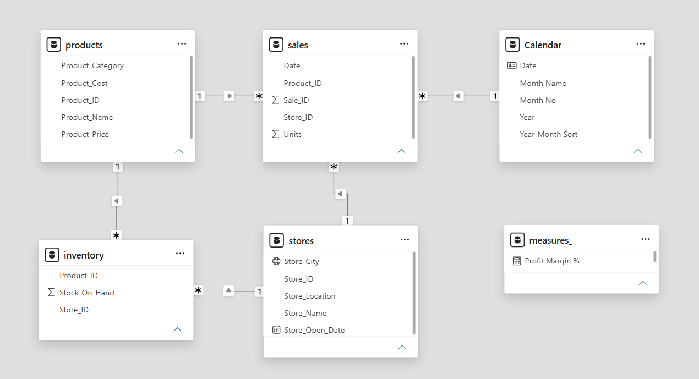
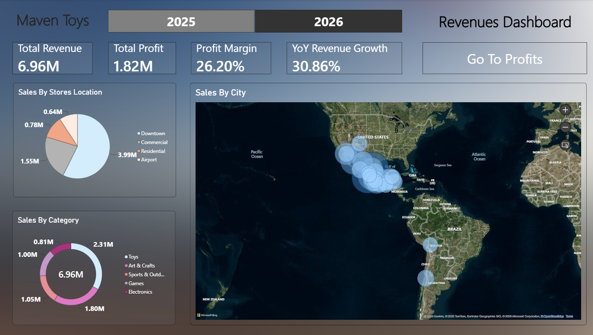
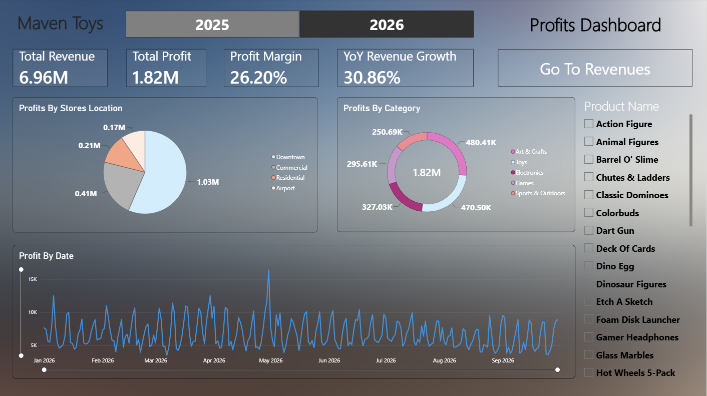

# 🧸 Toy Store Sales Analysis — Power BI Project

## 📌 Project Overview
This Power BI project provides an end-to-end sales performance and business intelligence analysis for a toy retail chain. The objective of this project is to model multi-table transactional data, calculate key performance indicators (KPIs) using custom DAX formulas, and design an interactive dashboard to empower business stakeholders to make data-driven decisions regarding inventory, sales performance, and profitability.

---

## 🛠️ Key Requirements & Features Implemented

1. **Data Modeling:** Established relationships between the `sales` fact table and dimension tables in a Star Schema format.
2. **DAX Measures & KPIs:** Created calculated measures for core metrics such as Total Sales, Total Profit, Profit Margin %, Units Sold, and store performance analysis.
3. **Interactive Dashboard Design:** Designed dynamic visual layouts with clear hierarchy, slicers/filters (by City, Product Category, and Date).
4. **User Navigation & Bookmarks:** Integrated navigation bookmarks to enhance user experience and seamlessly toggle between view levels.
5. **Data Insights:** Identified actionable trends regarding high-margin product categories, top-performing retail locations, and inventory turnover recommendations.

---

## 📊 Data Model Schema
The dataset is structured as a **Star Schema** to ensure efficient query performance and streamlined aggregation:
* **Fact Table:** `sales`
* **Dimension Tables:** `products`, `stores`, `inventory`, `data_dictionary`, 'calendar(date table)'

---

## 🖥️ Dashboard Overview

---

## 📐 Key DAX Measures
[View Dax Measures](Measures/dax_measures.txt)

---

## 💡 Executive Insights & Strategic Recommendations

* **Cumulative Performance:** Generated **$4.01M in total net profit** ($2.19M in 2025 | $1.82M in 2026) across $14.44M in total revenues.
* **Top Sales Volume Driver:** `Toys` consistently leads overall sales volume across both years ($2.79M in 2025 | $2.31M in 2026).
* **Top Profit Drivers:** `Electronics` led profitability in 2025 ($674.41K profit), while `Art & Crafts` took the lead in 2026 ($480.41K profit).
* **Geographic Engine:** `Downtown` store locations generate over 50% of total company net profits ($1.22M in 2025 | $1.03M in 2026).
* **Strategic Actions:** Prioritize stock replenishment for Downtown locations to eliminate stockouts, and expand product offerings in high-margin categories (`Electronics` & `Art & Crafts`).

📄 **[Read Full Insights Report (PDF)](Documentation/insights_report.pdf)**

---

## 🚀 How to Run the Project

1. Clone or download this repository to your local machine:
   git clone https://github.com/YOUR_USERNAME/toy-store-sales-analysis.git
2. Open `Toy-Store-Sales-Analysis.pbix` in **Power BI Desktop**.
3. Explore the interactive visuals, filter panel, and bookmarks.
